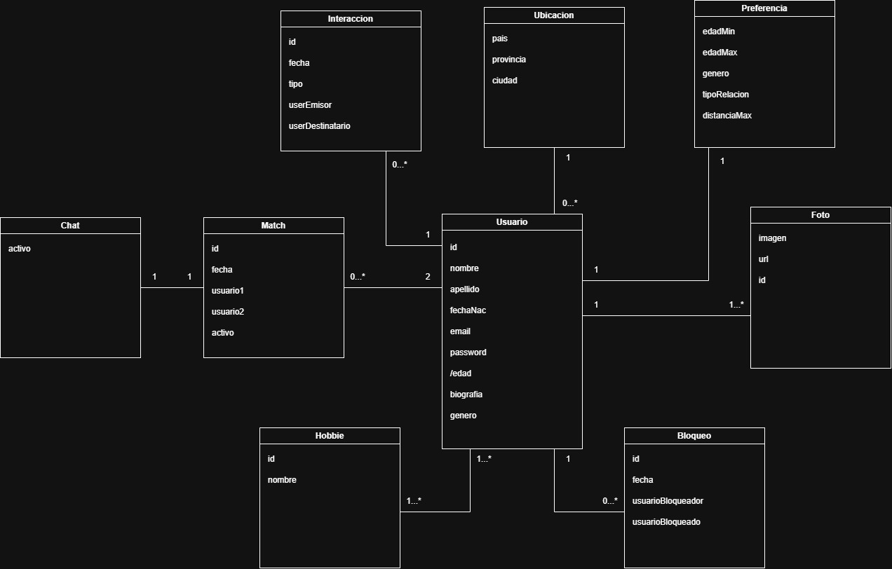

# Propuesta TP DSW

## Grupo
### Integrantes
* 54527 - Volker, Ramiro
* 53935 - Leiva, Milagros
* 54641 - Starna, Adolfo 

### Repositorios
* [frontend app](http://hyperlinkToGihubOrGitlab)
* [backend app](http://hyperlinkToGihubOrGitlab)
*Nota*: si utiliza un monorepo indicar un solo link con fullstack app.

## Tema: 
### Descripción
*Matchify es la app ideal para conocer nuevas personas. Explorá perfiles, filtrá según tus preferencias y generá matches cuando haya interés mutuo. Una vez conectados, podés chatear y empezar a crear nuevas experiencias.*

### Modelo

## Alcance Funcional 

### Alcance Mínimo

Regularidad:
|Req|Detalle|
|:-|:-|
|CRUD simple|1. CRUD Usuario 2. CRUD Ubicacion 3. CRUD Hobbie |
|CRUD dependiente|1. CRUD Preferencia {depende de} CRUD Usuario|
|Listado + detalle| 1. Listado de usuarios filtrado por distancia, muestra usuarios dentro del rango establecido => detalle CRUD Usuario |
|CUU/Epic|1. Login del usuario 2. Dar like a otro usuario 3. Matchear con otro usuario 4. Bloquear a otro usuario|

Adicionales para Aprobación
|Req|Detalle|
|:-|:-|
|CRUD |1. CRUD Chat {depende de} CRUD Match|
|CUU/Epic|1. Chatear con otro usuario  2. Denunciar a otro usuario  3.Agregar fotos|

### Alcance Adicional Voluntario

*Nota*: El Alcance Adicional Voluntario es opcional, pero ayuda a que la funcionalidad del sistema esté completa y será considerado en la nota en función de su complejidad y esfuerzo.

Todavía no definido.

|Req|Detalle|
|:-|:-|
|Listados |1. Estadía del día filtrado por fecha muestra, cliente, habitaciones y estado  2. Reservas filtradas por cliente muestra datos del cliente y de cada reserve fechas, estado cantidad de habitaciones y huespedes|
|CUU/Epic|1. Consumir servicios 2. Cancelación de reserva|
|Otros|1. Envío de recordatorio de reserva por email|

